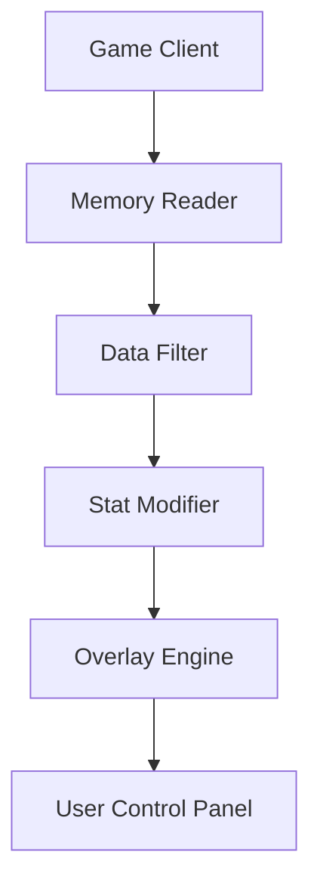

# Limbus Company Cheat 

Step into the madness of **Limbus Company**—a world where every clash teeters on the edge of ruin and revelation. The **Limbus Company Cheat (2025 Edition)** is a precision-built software utility for players seeking **control, efficiency, and optimization** in every combat scenario. It enhances tactical flow, resource balance, and character progression while maintaining smooth, stable performance across modern Windows systems.

---

## ⚙️ Overview

The 2025 version redefines tactical manipulation by introducing **turn-sequence optimization**, **auto-skill scripting**, and **damage prediction overlays**. Whether you’re managing an entire Sinner squad or fine-tuning resource gains, this trainer-style cheat suite operates discreetly in the background, feeding real-time adjustments that streamline gameplay without breaking immersion.

> [!IMPORTANT]
> This software is designed strictly for **client-side experimentation and testing**. Use responsibly in offline or sandbox environments.

---


---

## 🧩 Key Features

### 💥 Combat Optimizer

* **Auto-chain skills** for ideal combo execution.
* Predicts **enemy move order** using memory-scanned initiative data.
* Toggles “Perfect Clash” mode for guaranteed win outcomes.
* Synchronized with speed-tier mechanics.

### 🩸 Resource & Sanity Control

* Infinite **EGO energy** toggle (`F5`).
* Adjustable **Sanity balance** between -45 and +45.
* Modify currency and materials during dungeon prep.

### ⚡ Damage Tweaker

* Real-time **damage multiplier** (x1–x10).
* Optional **minimum roll lock** (no low rolls in clashes).
* Custom per-Sinner scaling for damage or defense.

### 🎭 Auto Progression Mode

* Automates **grind and farming** phases.
* Intelligent script logic skips story delays.
* Can auto-accept drops and complete stages efficiently.

---

## 🧠 Advanced Visualization

* Overlay shows **clash outcomes**, **enemy buffs**, and **probability stats**.
* Toggle simplified **UI color themes** for clarity.
* Works in both windowed and fullscreen borderless modes.

---

## 🧩 Compatibility

| Component                | Supported Version    | Notes                           |
| ------------------------ | -------------------- | ------------------------------- |
| **Game Build**           | Limbus Company v2.3+ | Auto-offset recognition         |
| **Operating System**     | Windows 10 / 11      | DX11 overlay supported          |
| **Injection Mode**       | Stealth / Internal   | Auto-hooks via protected memory |
| **Hardware Requirement** | 4GB RAM, DX11 GPU    | Low resource footprint          |

> [!NOTE]
> The cheat uses adaptive process detection — it automatically aligns with game updates without manual patching.

---

## ⚙️ Setup Guide

1. **Extract** the archive to a safe folder (e.g. `C:\LimbusTrainer`).

2. Launch the game and let it reach the main menu.

3. Run the tool as Administrator:

   ```bash
   limbus_cheat.exe --mode=stealth --overlay=active
   ```

4. Default hotkeys:

   * `F3`: Enable Combat Optimizer
   * `F5`: Infinite EGO
   * `F6`: Auto Progression Mode
   * `Ctrl + M`: Damage Multiplier Console

5. Save your profile settings via:

   ```bash
   save_config build_alpha.json
   ```

> [!WARNING]
> Avoid toggling multiple features during loading screens; this may desync the overlay for one frame cycle.

---

## 🔄 System Diagram



---

## 💡 Configuration Example

```json
{
  "auto_clash": true,
  "ego_energy": "infinite",
  "sanity_value": 40,
  "damage_multiplier": 5,
  "auto_progression": true
}
```

---

## 🧭 Feature Summary Table

| Function              | Description                      | Default Key |
| --------------------- | -------------------------------- | ----------- |
| **Auto Clash Mode**   | Always win clashes automatically | `F3`        |
| **EGO Boost**         | Unlimited EGO energy             | `F5`        |
| **Damage Multiplier** | Adjust base damage scaling       | `Ctrl + M`  |
| **Sanity Balance**    | Lock sanity at any level         | `Alt + S`   |
| **Auto Farming**      | Completes dungeons automatically | `F6`        |

---

## ❓ FAQ

**Q1: Does it work with story events or mirror dungeons?**
Yes, the trainer detects both and adjusts scripts accordingly.

**Q2: Can I use custom keybinds?**
Absolutely — remap all hotkeys in the `keymap.json` file.

**Q3: Will this lower my FPS?**
No. The overlay engine is fully asynchronous, maintaining native frame pacing.

**Q4: Can I save multiple character setups?**
Yes — up to 10 preset profiles per user.

**Q5: Is there an update checker?**
Yes — updates are verified via checksum before install.

---

## ⚡ Tactical Tips

* Set sanity at +45 for best roll outcomes.
* Use Auto Progression overnight for farming.
* Combine **Perfect Clash + Damage Multiplier 3x** for balanced gameplay.
* Always save a clean config before each patch cycle.

---

## 🏁 Final Thoughts

The **Limbus Company Cheat (2025 Edition)** gives tacticians the tools to command every battle flawlessly. From precision control over clashes to resource mastery and automated farming, this suite ensures **absolute dominance** in the psychological labyrinth of Project Moon’s universe — clean, stable, and endlessly configurable.

---

**© 2025 Limbus Tactical Systems** — Break the cycle. Control the madness. Command every clash.
